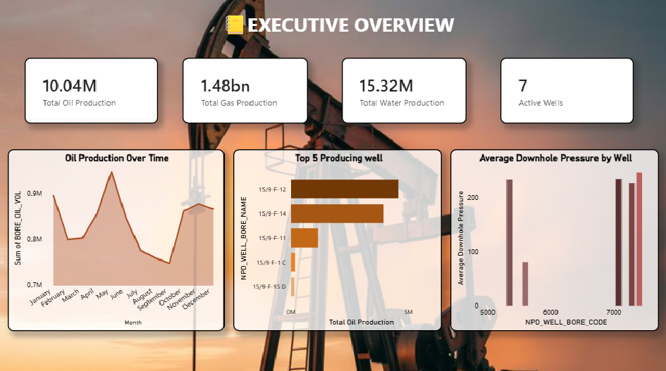
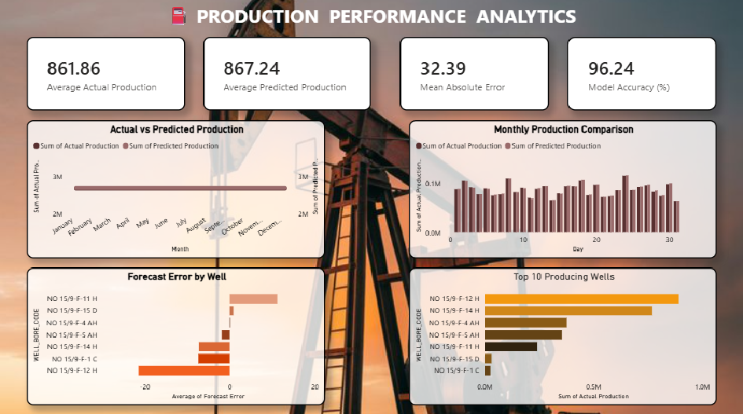
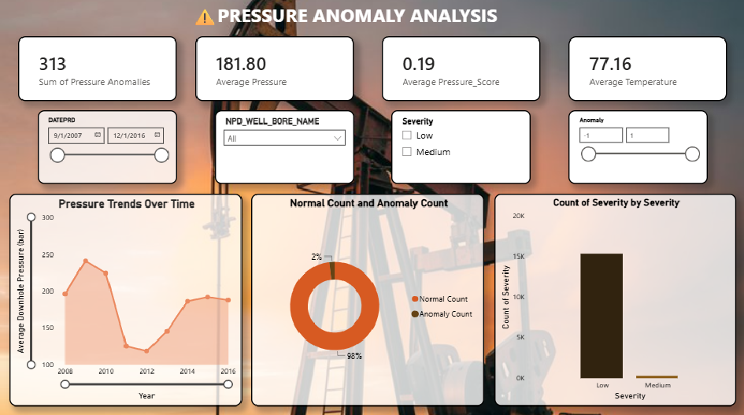
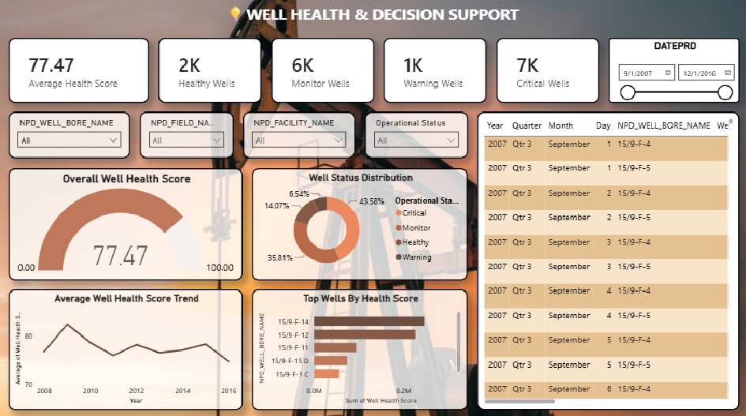
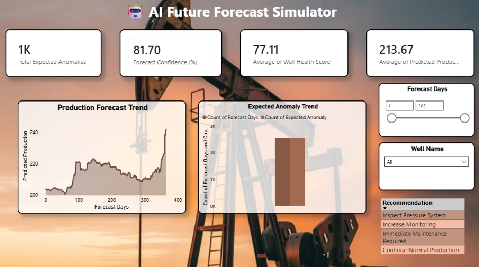
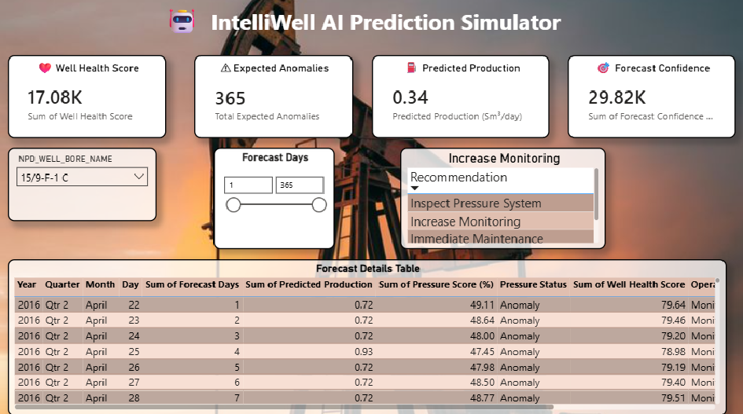
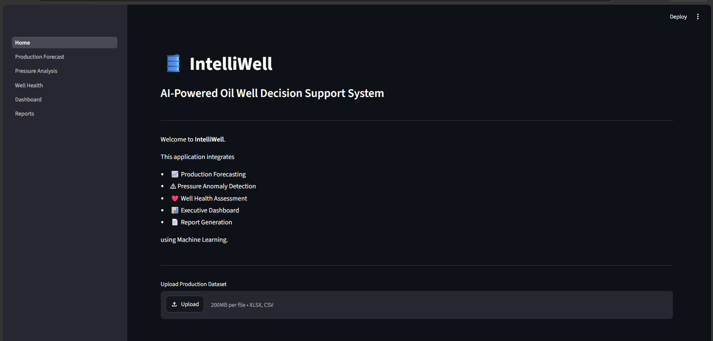
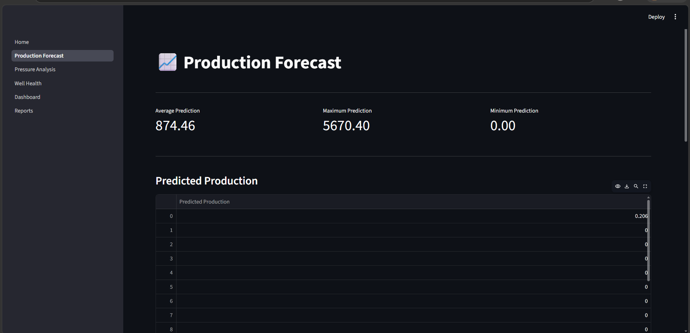
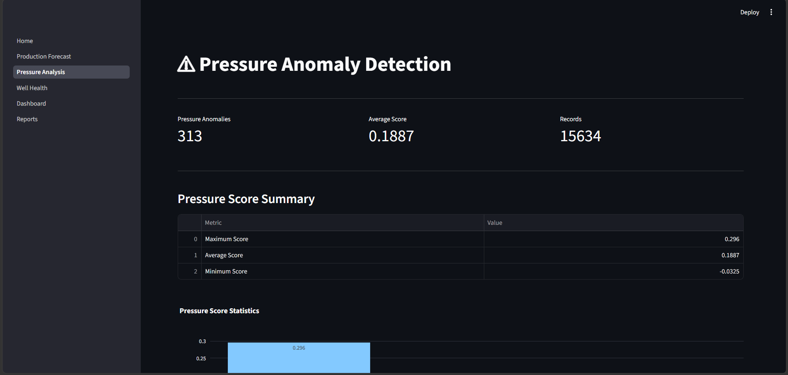
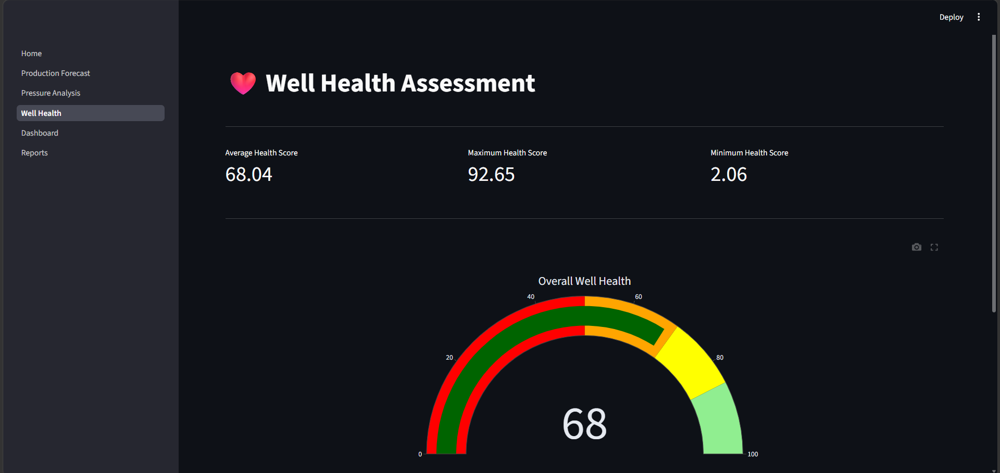

# IntelliWell AI Powered Predictive Maintenance Production Forecasting for Oil Wells
## 📌 Overview

IntelliWell is an AI-powered decision-support system developed for the petroleum industry to improve well monitoring, production forecasting, anomaly detection, predictive maintenance, and maintenance-report analysis.

The system combines Machine Learning, Natural Language Processing (NLP), Business Intelligence, Database Technologies, and Web Technologies to analyze historical well data and maintenance reports.

IntelliWell can forecast future oil production, detect abnormal pressure conditions, assess overall well health, analyze textual maintenance reports, generate maintenance insights, and present results through interactive Power BI and Streamlit dashboards.

## 🎯 Objectives
* Predict future oil production using Machine Learning.
* Detect abnormal pressure conditions using unsupervised learning.
* Assess overall well health and operational risk.
* Generate maintenance recommendations based on well conditions.
* Forecast future production and operational conditions.
* Analyze maintenance reports using Natural Language Processing.
* Identify maintenance issue categories, keywords, summaries, and priorities from textual reports.
* Build interactive Business Intelligence dashboards.
* Develop an AI prediction simulator using Flask and Streamlit.
* Integrate ML, NLP, SQL, Power BI, and web technologies into a unified petroleum analytics system.
## 🛠️ Technology Stack
### Programming
* Python
### Machine Learning
* Scikit-learn
* Random Forest Regressor
* Isolation Forest
### Data Processing
* Pandas
* NumPy
### Visualization
* Matplotlib
### Business Intelligence
* Microsoft Power BI
### Database
* PostgreSQL
### Web Application
* Flask
* Streamlit

## 📂 Project Structure
```
IntelliWell/
│
├── datasets/
│
├── notebooks/
│   ├── Notebook 1 - Production Forecasting.ipynb
│   ├── Notebook 2 - Pressure Anomaly Detection.ipynb
│   ├── Notebook 3 - Well Health Assessment.ipynb
│   ├── Notebook 4 - Future Forecast Generator.ipynb
│   └── Notebook 5 - NLP Maintenance Report Analysis.ipynb
|
├── backend/
│   ├── app.py
│   ├── routes.py
│   ├── services.py
│   ├── preprocess.py
│   ├── model_loader.py
│   ├── config.py
│
├── frontend/
│   ├── Home.py
│   ├── pages/
│
├── powerbi/
│   ├── IntelliWell.pbix
│
├── sql/
│   ├── Database.sql
│
├── models/
│   ├── production_model.pkl
│   ├── pressure_model.pkl
│   ├── pressure_scaler.pkl
│
├── outputs/
│   ├── future_forecast.csv
│   ├── pressure_anomaly_results.csv
│   ├── well_health_results.csv
│   ├── IntelliWell_Final_Report.csv
│
└── README.md
```

## 📊 IntelliWell Analytics Pipeline
```
                    IntelliWell
                         │
          ┌──────────────┴──────────────┐
          │                             │
          ▼                             ▼
 Historical Well Data          Maintenance Reports
          │                             │
          ▼                             ▼
    Data Cleaning                Text Cleaning
          │                             │
          ▼                             ▼
 Feature Engineering           NLP Preprocessing
          │                             │
          ▼                             ▼
   Machine Learning              NLP Analysis
          │                             │
    ┌─────┴─────┐                       │
    ▼           ▼                       ▼
Production   Pressure             Issue Category
Forecast     Anomaly              Keywords
            Detection             Summary
    │           │                 Priority
    └─────┬─────┘                       │
          ▼                             │
  Well Health Assessment                │
          │                             │
          ▼                             │
 Future Forecast Generator              │
          │                             │
          └──────────────┬──────────────┘
                         ▼
              Decision Support Layer
                         │
              ┌──────────┴──────────┐
              ▼                     ▼
           Power BI              Streamlit
           Dashboard             Web App
```
## 📊 Machine Learning Pipeline
```
Historical Well Data
        │
        ▼
Data Cleaning
        │
        ▼
Feature Engineering
        │
        ▼
Random Forest
(Production Forecast)
        │
        ▼
Isolation Forest
(Pressure Anomaly Detection)
        │
        ▼
Well Health Assessment
        │
        ▼
Future Forecast Generator
        │
        ▼
Power BI + Streamlit
```
## 🤖 Machine Learning Models
#### Production Forecasting

Algorithm :
```
Random Forest Regressor
```
Purpose

* Predict future production
* Estimate production decline
* Support production planning

### Pressure Anomaly Detection

Algorithm
```
Isolation Forest
```
Purpose

* Detect abnormal pressure conditions
* Identify potential equipment failures
* Support predictive maintenance

## ❤️ Well Health Assessment

### The health score combines

* Production Performance
* Pressure Stability
* Operational Status

### The system classifies wells into

* Healthy
* Monitor
* Warning
* Critical

and automatically generates maintenance recommendations.

## 🔮 Future Forecasting

The Future Forecast Generator extends the ML pipeline by estimating future well behavior over different forecasting horizons.

The forecasting engine simulates factors such as:

* Production decline
* Pressure degradation
* Operational variations

Forecasting horizons can range from:

1 → 365 Days

The generated results can be used by Power BI and the IntelliWell prediction interface for future well-condition analysis.

## 🧠 NLP Maintenance Report Analysis

IntelliWell also includes a Natural Language Processing (NLP) module for analyzing textual maintenance and engineering reports.

The maintenance-report dataset contains:

report_text
category

The report_text column contains textual maintenance observations, while category represents the known maintenance issue category.

## NLP Pipeline
```
Maintenance Reports
        │
        ▼
Text Cleaning
        │
        ▼
Tokenization
        │
        ▼
Stopword Removal
        │
        ▼
Lemmatization
        │
        ▼
Text / Keyword Analysis
        │
        ├──────────────► Issue Category
        │
        ├──────────────► Keywords
        │
        ├──────────────► Summary
        │
        └──────────────► Priority
        │
        ▼
NLP Maintenance Results
```

## NLP Output

The NLP module produces structured information including:

* Original Maintenance Report
* Cleaned Report
* Maintenance Category
* Issue Category
* Important Keywords
* Report Summary
* Maintenance Priority
A typical processed result contains fields such as:

Report ID
report_text
Clean Report
category
Issue Category
Keywords
Summary
Priority

#### Report ID #### can be generated by the analysis pipeline to uniquely identify each processed maintenance report.

The NLP module helps convert unstructured maintenance text into structured information that can be used for maintenance analysis and decision support.


## 📈 Power BI Dashboards
### 1. Executive Overview

Overall KPIs

* Total Production
* Total Wells
* Average Health Score
* Production Trends
### 2. Production Analytics
* Production Trends
* Well Performance
* Field Performance
* Production Distribution
### 3. Pressure Anomaly Analytics
* Pressure Trends
* Anomaly Detection
* Severity Distribution
* Pressure Monitoring
### 4. Well Health Analytics
* Health Scores
* Operational Status
* Maintenance Recommendations
* Risk Assessment
### 5. Operational Intelligence
* Overall Operational Insights
* Performance Comparison
* Executive Reporting
### 6. Future Forecast Analytics
* Future Production Trend
* Expected Anomalies
* Forecast Confidence
* Forecast Health Score
### 7. AI Prediction Simulator

Interactive dashboard allowing users to select

* Forecast Day
* Well
* Field
* Facility

and instantly view

* Predicted Production
* Expected Anomalies
* Well Health Score
* Forecast Confidence
* AI Recommendation

### 📊 Power BI Dashboards

| Executive | Production | Pressure |
|------------|------------|-----------|
|  |  |  |

| Well Health | Forecast | AI Simulator |
|--------------|----------|--------------|
|  |  |  |

## 🌐 Web Application

The Streamlit application provides an interactive interface for accessing IntelliWell's analytics capabilities.

Users can:

* Upload well datasets.
* Run production forecasting.
* Detect pressure anomalies.
* View well health reports.
* Explore future forecasts.
* View AI-generated maintenance recommendations.

The backend is powered by Flask REST APIs, which provide communication between the machine-learning components and the user-facing application.

### 🌐 Streamlit Web Application

| Home | Production Forecast |
|------|----------------------|
|  |  |

| Pressure Analysis | Well Health |
|-------------------|-------------|
|  |  |

## 🗄️ Database

PostgreSQL is used for storing:

* Production Data
* Pressure Data
* Anomaly Results
* Well Health Results
* Forecast Results

 ## 📈 Future Forecasting

The future forecasting engine simulates

* Production decline
* Pressure degradation
* Operational variations

for forecasting horizons ranging from 1 to 365 days. 

## 🚀 Features
* AI-based Production Forecasting
* Pressure Anomaly Detection
* Predictive Maintenance
* Well Health Assessment
* Future Forecast Simulation
* Business Intelligence Dashboards
* Interactive AI Prediction Simulator
* REST API Integration
* SQL Database Integration

  ## 🔮 Future Enhancements
* Real-time IoT sensor integration
* Live production monitoring
* Cloud deployment
* Automated alert notifications
* Deep Learning forecasting models
* Explainable AI (SHAP/LIME)
* Digital Twin integration
* Mobile dashboard support
